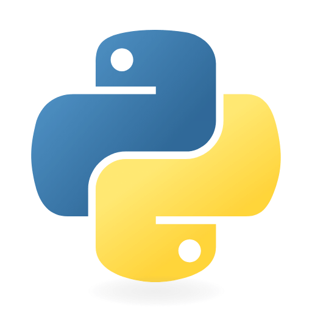

# Ayush Kumar

**Backend Developer · Full Stack Builder · AI/ML Explorer**

*3rd-year B.Tech CSE @ KIIT · Building scalable software and intelligent systems*

---

### About Me

I am a third-year Computer Science student at KIIT focused on backend engineering, full-stack development, and applied machine learning.

I build systems that combine performance, scalability, and real-world usability — from real-time competitive platforms and OS-level shells to ML-powered web applications.

- 🔧 Currently building **DevArena** — a real-time competitive coding platform
- 🧠 Exploring applied ML, NLP, and intelligent system design
- 📍 Bhubaneswar, India

---

### Tech Stack

#### Languages

  
  
  
  
  

#### Backend

  
  
  

#### Frontend

  
  

#### Databases

  

#### Tools

  
  
  
  
  

---

### Featured Projects

| Project | Description | Stack |
|---|---|---|
| [**DevArena**](https://github.com/Aayu62/DevArena) | Real-time competitive coding platform with matchmaking, Elo rating, WebSocket battles, and Docker-sandboxed code execution | React · Spring Boot · PostgreSQL · Docker |
| [**AyushOS**](https://github.com/Aayu62/AyushOS) | Unix-like shell in 1,600+ lines of C with piping, redirection, Round Robin scheduler, and virtual memory subsystem | C · Linux · POSIX |
| [**Connect 4 AI**](https://github.com/Aayu62/connect4) | Web-based Connect 4 with minimax AI, depth-4 lookahead, and 5 heuristic scoring factors | Django · Python · JavaScript · NumPy |
| [**Sentiment Analysis App**](https://github.com/Aayu62/sentiment-app) | Full-stack sentiment classifier with real-time REST inference API | FastAPI · JavaScript · Scikit-learn |

---

### GitHub Stats

---

*Open to internships, collaboration, and interesting technical discussions.*

